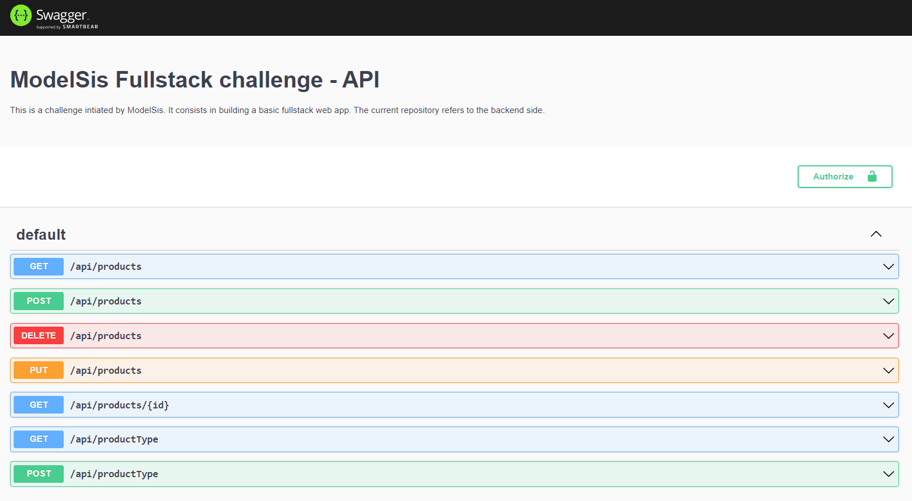

<p align="center">
  <a href="" rel="noopener">
 </a>
</p>
<h1 align="center">modelsis-nodejs-fullstack</h1>

## 🏁Description

<div style="text-align: justify">This is a challenge intiated by ModelSis.
It consists in building a basic fullstack wep app.
The current repository refers to the backend side.</div>


## ⛏️Built With

- [Node.js](https://nodejs.org/) - Runtine environment
- [Epxress.js](https://expressjs.com/) - Runtine environment
- [MongoDB](https://www.mongodb.com/) - Database


## ⛓️Prerequisites

- [Node.js](https://nodejs.org/) v14.18.0 or higher
- [MongoDB](https://www.mongodb.com/) v4.4.4 or higher

## 🚀Run

#### Clone repository
```
git clone https://github.com/MisterRoy/modelsis-nodejs-fullstack.git
```

#### Install dependencies
```
npm install
```
or
```
yarn install
```

#### Run MongoDB
```
mongod
```

#### Set environment variables (Optional)
You may define your database credentials if necessary. By default, the app assumes you use default configuration i.e no username, no password and using port 27017.
- On Linux / Mac OS
```
export MODELSIS_BD_USERNAME=your_database_username
export MODELSIS_BD_PASSWORD=your_database_password
export MODELSIS_BD_HOST=your_database_hostname
export MODELSIS_BD_PORT=your_database_port
export MODELSIS_PORT=your_running_port
```

- On Windows
```
set MODELSIS_BD_USERNAME=your_database_username
set MODELSIS_BD_PASSWORD=your_database_password
set MODELSIS_BD_HOST=your_database_hostname
set MODELSIS_BD_PORT=your_database_port
set MODELSIS_PORT=your_running_port
```
#### Launch
Ensure that port 4000 is free and run
```
npm start
```
or
```
yarn start
```

## 📙Documentation
Available at http://localhost:4000/api

